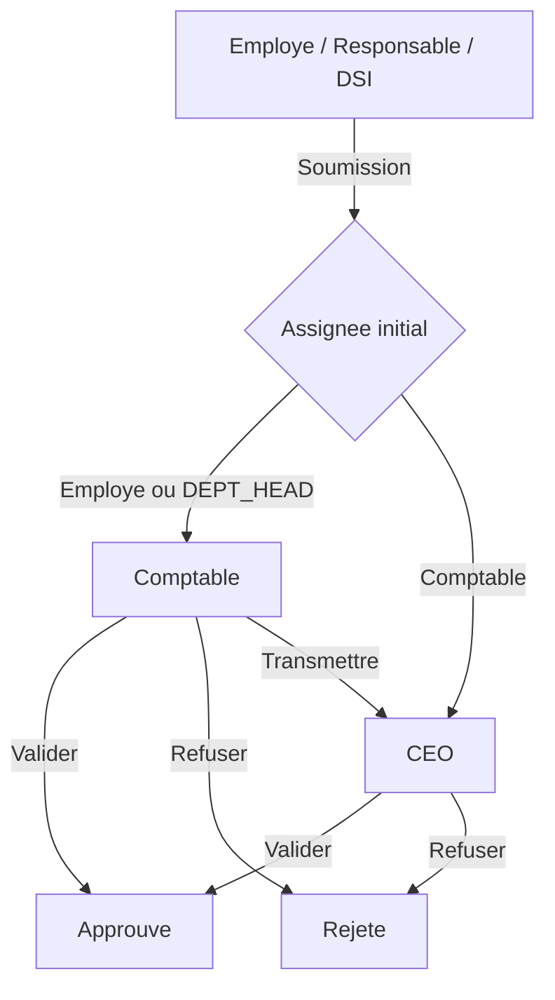

# Conge — Gestion RH (congés, paie, contrats)

Application Next.js 16 (App Router) + Prisma (MongoDB) + Tailwind. Gestion multi-rôles (CEO, Comptable, Directeur, Manager, Employé, DSI Admin) des congés, bulletins de paie, contrats, et notifications.

## Stack

- **Framework** : Next.js 16, React 19, TypeScript strict
- **DB** : MongoDB via Prisma 6
- **Auth** : JWT HS256 (cookie httpOnly + Authorization Bearer en legacy), bcrypt
- **Validation** : Zod (`lib/schemas/`)
- **Emails** : Nodemailer (SMTP)
- **Logs** : pino (JSON en prod, joli en dev)
- **Tests** : Vitest
- **CI** : GitHub Actions

## Démarrage local

```bash
git clone <repo> conge
cd conge
npm install

cp .env.example .env
# Éditer .env (DATABASE_URL, JWT_SECRET, SMTP_*)

docker compose up -d mongo   # Mongo + replica set
npx prisma db push
npm run seed                 # crée l'admin DSI initial
npm run dev                  # http://localhost:3000
```

## Scripts npm

| Script | Description |
| --- | --- |
| `npm run dev` | Démarre Next en mode développement |
| `npm run build` | Build production (sortie `.next/standalone`) |
| `npm start` | Démarre le serveur Next compilé |
| `npm run lint` | Lint ESLint |
| `npm run typecheck` | `tsc --noEmit` |
| `npm test` | Tests Vitest (run unique) |
| `npm run test:watch` | Tests Vitest en watch |
| `npm run test:coverage` | Tests + rapport de couverture |
| `npm run seed` | Seed initial (admin DSI) |

## Variables d'environnement

Voir `.env.example`. Les plus critiques :

- `DATABASE_URL` — URL Mongo avec replica set
- `JWT_SECRET` — secret HS256 fort (>= 32 octets aléatoires), à rotation régulière
- `SMTP_*` — config envoi de mails (sans : emails désactivés silencieusement)
- `LOG_LEVEL` — `info` par défaut en prod, `debug` en dev

## Architecture

```
app/
  api/              # Routes API Next.js (App Router)
  components/       # Composants UI partagés
  dashboard/        # Pages dashboards par rôle
lib/
  auth.ts           # JWT, cookies, requireRole, helpers d'authz
  dsiAdmin.ts       # Helpers admin DSI
  rate-limit.ts     # Rate-limit en mémoire
  schemas/          # Schémas Zod (validation des inputs)
  validate.ts       # parseBody(req, schema) — wrapper d'erreurs uniforme
  services/         # Couche métier (orchestration)
  repositories/     # Couche accès données (Prisma)
  logger.ts         # Logger pino centralisé
  leave-balance.ts  # Logique métier des soldes de congés
  leave-days.ts     # Calcul des jours ouvrés / fériés
  holidays.ts       # Helpers dates et jours fériés récurrents
prisma/
  schema.prisma     # Modèle de données (MongoDB)
  seed.ts           # Données initiales (admin DSI)
tests/
  lib/              # Tests Vitest sur la logique métier
```

### Patterns serveur

- **Auth** : toute route API valide le JWT via `verifyJwt`. Pour exiger un rôle, utiliser `requireRole(req, ["CEO", "ACCOUNTANT"])` ou `requireRoleOrDsiAdmin(req, [...])`.
- **Validation** : parser le body via `parseBody(req, schema)` (de `lib/validate.ts`).
- **Métier** : déporter la logique dans `lib/services/` (renvoie des données ou `throw new ServiceError(...)`).
- **Accès données** : `lib/repositories/` (sans logique métier, sans `NextResponse`).
- **Erreurs serveur** : `jsonServerError(e)` masque les détails en prod ; `serviceErrorToResponse(e)` traduit `ServiceError`.

## Sécurité

- JWT signés HS256 (algorithme pinné côté `verifyJwt`).
- Cookies `httpOnly + SameSite=Lax + Secure` (en prod) — voir `lib/auth.ts`.
- Rate-limit en mémoire sur `/api/auth/{login,register,forgot-password}` (à migrer Redis en multi-instance).
- Headers de sécurité dans `next.config.ts`. **CSP commentée en TODO** — à activer après tests avec nonces.
- Mot de passe : `bcrypt` cost 10, validation longueur min 8 (Zod).
- Reset de mot de passe : mot de passe aléatoire 16 chars envoyé par email, flag `mustChangePassword`.

## Docker

```bash
# Développement (hot reload, bind mount)
docker compose up --build

# Build production (image standalone, non-root, healthcheck)
docker build -t conge:prod --target runner .
docker run --rm -p 3000:3000 --env-file .env conge:prod
```

L'image prod tourne en `node:20-bookworm-slim`, `USER node`, `tini` comme PID 1, healthcheck HTTP sur `/api/health`.

## CI

GitHub Actions (`.github/workflows/ci.yml`) :
- `quality` : `lint` + `typecheck` + `prisma validate` + `test`
- `build` : `next build`
- `security` : `npm audit` (informatif, non bloquant)

## Tests

```bash
npm test                  # run unique
npm run test:watch        # watch
npm run test:coverage     # coverage HTML dans coverage/
```

Couverture actuelle : tests unitaires sur `lib/leave-days.ts`, `lib/holidays.ts`, `lib/rate-limit.ts`, `lib/auth.ts`. Cible 60 % sur `lib/services/` + `lib/leave-*.ts`. Tests E2E (Playwright) à venir.

## Seeds

`npm run seed` crée les comptes initiaux (PDG, DSI admin, Comptable DAF, Directeurs Opérations). Idempotent. Le mot de passe initial provient de `SEED_ADMIN_PASSWORD` (cf `.env.example`). Pour vérifier la création : `./scripts/check-seed.sh`.

## Workflow congés


```mermaid
flowchart TD
  A[Employe / Responsable / DSI] -->|Soumission| B{Assignee initial}
  B -->|Employe ou DEPT_HEAD| C[Comptable]
  B -->|Comptable| D[CEO]
  C -->|Valider| E[Approuve]
  C -->|Refuser| F[Rejete]
  C -->|Transmettre| D
  D -->|Valider| E
  D -->|Refuser| F
```

## Roadmap (extrait)

- [ ] Migrer les bulletins PDF de MongoDB vers blob storage (S3 / MinIO)
- [ ] Activer une CSP stricte avec nonces
- [ ] Migrer les dashboards en RSC (96 fichiers `"use client"` à réviser)
- [ ] Tests E2E Playwright
- [ ] Sentry / observabilité
- [ ] Multi-instance : remplacer le rate-limit en mémoire par Redis
- [ ] Factoriser les pages dupliquées `app/dashboard/*/leave/new/page.tsx` (~2 200 lignes)

## Contribuer

Voir `CONTRIBUTING.md`.

## Notes

- Solde annuel par défaut : 26 jours (modifiable par le CEO).
- Solde visible employé = base annuelle − (soumis + en attente + approuvés).
- Les demandes sont assignées automatiquement selon le rôle du demandeur.
