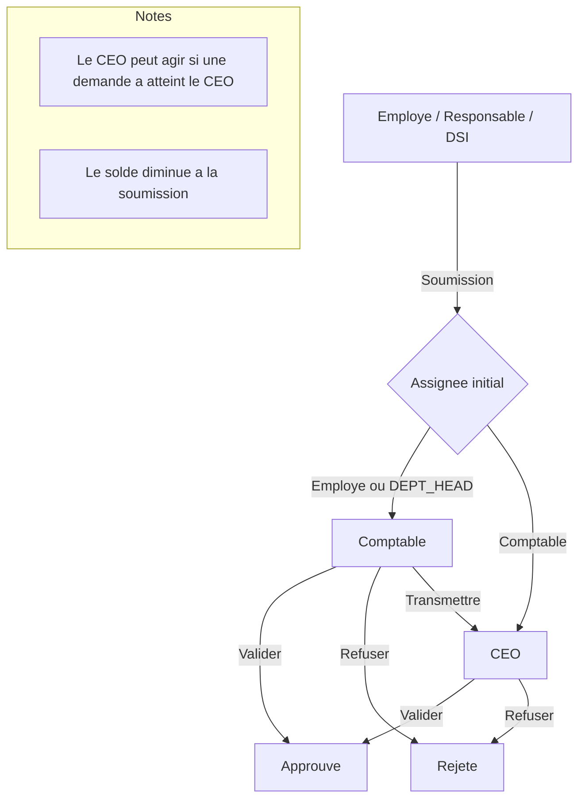

# CONGES

Application de gestion des conges (Next.js + Prisma + MongoDB) avec roles (CEO, Comptable, Responsable, Employe), workflows de validation et tableaux de bord.

## Fonctionnalites principales
- Authentification par email ou matricule
- Workflow des demandes de conge (soumission, validation, refus, transmission)
- Dashboards par role (Employe, Responsable, DSI, Comptable, CEO)
- Solde annuel de conges (base par defaut 25 jours, ajustable par le CEO)
- Historique des demandes et decisions

## Stack
- Next.js (App Router)
- React 19
- Prisma + MongoDB
- Tailwind CSS
- react-hot-toast

## Installation
```bash
npm install
```

## Configuration
Créer un fichier `.env` à la racine et définir :
```
DATABASE_URL=
JWT_SECRET=
DEPT_HEAD_VALIDATION_DAYS=5
```

## Prisma
Appliquer le schema et regenerer le client :
```bash
npx prisma db push
npx prisma generate
```

## Comptes
Créez les comptes de démarrage directement dans Mongo ou via votre propre script : les identifiants par défaut ne sont plus fournis automatiquement.

## Lancer le projet
```bash
npm run dev
```
Puis ouvrir http://localhost:3000

## Docker
### Développement avec MongoDB local
- `docker compose up --build` matérialise deux services : l'app Next (avec hot reload) et une base Mongo (`mongo:7.0`).  
  Le conteneur de l'app monte votre code (`.:/app`) ainsi que `node_modules`/`.next` pour éviter de recompiler à chaque changement.
- La variable `DATABASE_URL` est automatiquement pointée vers `mongodb://mongo:27017/conge` (ajustez `.env` si vous utilisez un autre nom de base).
```bash
docker compose up --build
```
Puis ouvrir http://localhost:3000

### Production (ex. OVH)
- Assurez-vous que votre serveur OVH héberge une base MongoDB (pas Atlas) et que la variable `DATABASE_URL` pointe vers ce service, par exemple `mongodb://mongodb.internal:27017/conge`.  
- Construisez l'image à partir du `runner` stage (production) :
```bash
docker build -t conge:latest --target runner .
```
- Démarrez un conteneur en reliant votre `.env` (avec `DATABASE_URL` réel) :
```bash
docker run --rm -p 3000:3000 --env-file .env conge:latest
```

### Seeds
- Utilisez `npm run seed` (ou `ts-node --transpile-only prisma/seed.ts`) pour créer les comptes PDG, DSI (admin), Comptable DAF, Directeur des opérations et les trois sous-directeurs automatiquement. Le script est idempotent : si un utilisateur existe déjà, il ne le remplace pas.
- Indiquez `SEED_ADMIN_PASSWORD` dans `.env` / `.env.production` pour définir le mot de passe commun aux comptes initiaux (défaut : `ChangeMe123!`). Les mots de passe sont hashés côté Prisma.
- Les trois sous-directeurs sont rattachés aux services Information, Réputation et Qualité de la Direction des Opérations, ce qui garantit qu’ils héritent des workflows attendus.
- Pour vérifier en une seule commande qu’ils sont présents, exécute `./scripts/check-seed.sh` après avoir démarré les services Docker (ou `./scripts/check-seed.sh -c <compose-file>` si tu utilises un autre fichier Compose).

## Notes importantes
- Le solde annuel par defaut est 25 jours.
- Le CEO peut augmenter ou reinitialiser le solde d'un employe.
- Le solde visible par l'employe = base annuelle - jours consommes (soumis + en attente + approuves).
- Les demandes sont assignees automatiquement selon le role de l'employe.

## Workflow (diagramme)


## Scripts utiles
- `npm run dev` : serveur de dev
- `npm run build` : build
- `npm run start` : production
- `npm run lint` : lint
